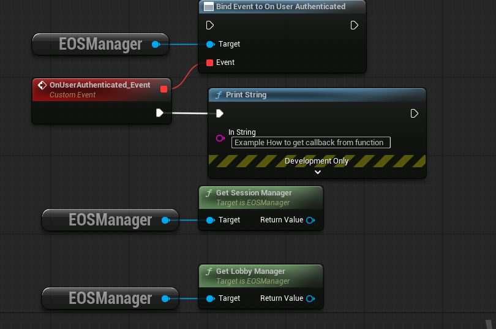

# EasyMatchmaking Plugin - Documentation

**Quick, guide to get multiplayer working with EOS lobbies and dedicated servers.**

---

## Table of Contents

1. [Installation](#installation)
2. [Plugin Configuration](#plugin-configuration)
3. [EOS Account Setup](#eos-account-setup)
4. [Testing Lobbies (No Server Needed)](#testing-lobbies-no-server-needed)
5. [Building Dedicated Server & Client](#building-dedicated-server--client)
6. [Running Your Server & Clients](#running-your-server--clients)
7. [Common Issues & Solutions](#common-issues--solutions)
8. [Dev Auth Tool (Advanced)](#dev-auth-tool-advanced)


## Installation

### Step 1: Add Plugin to Project

**Option A - Download:**
1. Download the plugin from [github](https://github.com/DanielKocan/EasyMatchmaking)
2. Extract to `YourProject/Plugins/EasyMatchmaking/`

**Option B - Git Clone:**
```bash
cd YourProject/Plugins
git clone https://github.com/DanielKocan/EasyMatchmaking.git
```

### Step 2: Generate Project Files

1. Right-click your `.uproject` file
2. Select **Generate Visual Studio project files**
3. Wait for it to complete

### Step 3: Open Project

1. Open your project in Unreal Engine
2. When prompted to rebuild modules, click **Yes**
3. Wait for compilation (2-5 minutes)

### Step 4: Enable Plugin

The plugin should be **automatically enabled**. To verify:

1. Go to **Edit -> Plugins**
2. Search for "EasyMatchmaking"
3. Make sure it's checked ✅

### Step 5: Disable Conflicting Plugins

**IMPORTANT:** Disable these plugins to avoid conflicts:

- ❌ **FAB plguin**
- ❌ **Online Subsystem EOS** (uncheck it)
- ❌ **Online Services EOS**
- ❌ **Online Services EOS (Game Services)**
- ❌ **EOS Voice Chat**
- ❌ **EOS Overlay Input Provider**

**Keep these ENABLED:**
- ✅ **EasyMatchmaking**
- ✅ **EOS Shared** (required for EOS SDK initialization)

### Step 6: Restart Editor

After disabling plugins, restart Unreal Engine.

## Plugin Configuration

### Add Your EOS Credentials

1. Go to **Project Settings -> Game: Easy Matchmaking**
2. Fill in your EOS credentials:

**EOS Credentials:**
- **Product ID**: From Epic Developer Portal
- **Sandbox ID**: From Epic Developer Portal
- **Deployment ID**: From Epic Developer Portal

**EOS User Credentials:**
- **Client ID**: From your EOS application
- **Client Secret**: From your EOS application (keep this private!)

**Server Credentials (for Dedicated Servers):**
- **Server Client ID**: Create a separate client credential for servers
- **Server Client Secret**: Server's client secret

**Where to get these credentials?** See [EOS Account Setup](#eos-account-setup) below.

## EOS Account Setup

### Quick Version

1. Create an Epic Games account at [dev.epicgames.com](https://dev.epicgames.com)
2. Create a new **Product**
3. Create a **Sandbox** within that product
4. Create a **Deployment**
5. Create **Client Credentials** (one for game client, one for dedicated server)
6. Copy Product ID, Sandbox ID, Deployment ID, Client IDs and Secrets
7. Paste them in **Project Settings -> Game -> Easy Matchmaking**

### Important: Add Test Users to Sandbox

**By default, EOS Sandboxes are private!** You must add testers manually:

1. In Epic Developer Portal -> Your Product -> Sandbox Settings
2. Go to **Members** or **Permissions** tab
3. **Add Epic Account IDs** of all people who will test your game
4. Each tester needs to be added individually

**To go public:** Submit a request to Epic Games (for released games only)

**Why?** If test users aren't added to the sandbox, they'll get authentication errors!

### Full Setup Guide

For detailed step-by-step instructions, check Epic's official guide (Dont do Step C "Download the EOS SDK", follow only first two (A and B) steps):  
[Epic Online Services - Getting Started](https://dev.epicgames.com/docs/epic-online-services/eos-get-started/get-started-guide/set-up-account-and-download-eos-sdk)


## Testing Lobbies (No Server Needed)

You can test lobbies **without building a dedicated server** because lobbies are peer-to-peer!

### What Are Lobbies?

Lobbies are for **pre-game matchmaking**:
- Find and gather players
- Chat before the game starts
- Ready-up system
- Find a dedicated server together
- Auto-join as a party

### Basic Lobby Flow

```
Create Lobby -> Friends Join -> Everyone Ready -> Host Finds Server -> Everyone Auto-Joins
```

### Testing in PIE (Play In Editor)

**Quick multiplayer testing without building:**

1. **Project Settings -> Editor -> Play**
2. Set **Number of Players**: 1 (or more)
3. In the editor toolbar: **Play (dropdown) -> New Editor Window (PIE)**
4. Multiple windows will open

**Authentication in PIE:**
- **First window (PIE 0)**: Uses Epic Account browser login
- **Additional windows (PIE 1, 2, 3...)**: Use Dev Auth credentials from plugin settings

**Add PIE Test Accounts:**
1. **Project Settings -> Game -> Easy Matchmaking**
2. Click **Advanced** to expand
3. Find **Temporary PIE Accounts** array
4. Click **+** to add entries for PIE instances 1, 2, 3, etc.
5. Set **Host**: `localhost:6547`, **Token**: `Player1`, `Player2`, etc.

> **Note:** Dev Auth Tool must be running for PIE instances 1+ to work! See [Dev Auth Tool](#dev-auth-tool-advanced).

**PIE Limitations:**
- Works great for lobby testing
- Has issues with World Partition when joining dedicated servers
- Use packaged builds for full server testing

### Using Example Blueprints

1. Check `Plugins/EasyMatchmaking/Content/Examples/` for example widgets and Blueprints
2. Use these as templates for your own UI
3. Key Blueprint functions:
   - `Create Lobby` - Create a new lobby
   - `Search Lobbies` - Find existing lobbies
   - `Join Lobby` - Join a lobby by ID
   - `Set Player Ready` - Mark yourself as ready
   - `Leave Lobby` - Exit current lobby

**Workflow:**
1. Player 1: Creates lobby
2. Player 2: Searches lobbies, joins
3. Both: Set ready status
4. Ready to find a server!

## Building Dedicated Server & Client

To run a real dedicated server and connect from packaged clients, you need to build executables.

### Prerequisites

**You must use Unreal Engine built from source** (not the Epic Launcher version).

**Why?** Dedicated server builds require access to engine source code.

**How to build UE from source:**  
Follow Epic's official guide: [Building Unreal Engine from Source](https://docs.unrealengine.com/5.6/en-US/building-unreal-engine-from-source/)

### Step 1: Create Build Target Files

Create these two files in your `YourProject/Source/` folder:

**YourProjectServer.Target.cs:**
```csharp
using UnrealBuildTool;
using System.Collections.Generic;

public class YourProjectServerTarget : TargetRules
{
    public YourProjectServerTarget(TargetInfo Target) : base(Target)
    {
        Type = TargetType.Server;
        DefaultBuildSettings = BuildSettingsVersion.V5;
        IncludeOrderVersion = EngineIncludeOrderVersion.Unreal5_6;
        ExtraModuleNames.Add("YourProject"); // <- Replace with your project module name!
    }
}
```

**YourProjectClient.Target.cs:**
```csharp
using UnrealBuildTool;
using System.Collections.Generic;

public class YourProjectClientTarget : TargetRules
{
    public YourProjectClientTarget(TargetInfo Target) : base(Target)
    {
        Type = TargetType.Client;
        DefaultBuildSettings = BuildSettingsVersion.V5;
        IncludeOrderVersion = EngineIncludeOrderVersion.Unreal5_6;
        ExtraModuleNames.Add("YourProject"); // <- Replace with your project module name!
    }
}
```

> **Important:** Replace `YourProject` with your actual project's module name (usually same as .uproject name)

### Step 2: Regenerate Project Files

1. Right-click your `.uproject` file
2. Select **Generate Visual Studio project files**
3. Wait for it to complete
4. Open the `.sln` file in Visual Studio 2022

You should now see new build targets:
- `YourProjectServer`
- `YourProjectClient`

### Step 3: Build in Visual Studio

**For Server:**
1. In Visual Studio, select configuration dropdown
2. Choose **Development Server**
3. Select platform: **Win64**
4. **Build -> Build Solution**
5. Wait for compilation (5-10 minutes first time, 1-2 min after)

**For Client:**
1. Select configuration: **Development Client**
2. Platform: **Win64**
3. **Build -> Build Solution**

**Output location:**
- Server: `YourProject/Binaries/Win64/YourProjectServer.exe`
- Client: `YourProject/Binaries/Win64/YourProjectClient.exe` (or `YourProject.exe`)

### Step 4: Cook Content

**Cooking packages your maps, Blueprints, and assets for the executable to use.**

**In Unreal Editor:**

1. **Platforms -> Windows -> Cook Content**
2. Select **Development** configuration
3. Click **Cook**
4. Wait for cooking (10-20 minutes first time, 2-5 min with iterative cooking)

**Where cooked content goes:**
```
YourProject/Saved/Cooked/Windows/
```

The executables in `Binaries/Win64/` automatically find and use this cooked content.

## Running Your Server & Clients

After building (Visual Studio) and cooking (Unreal Editor), you're ready to run!

### Start the Dedicated Server

Navigate to `YourProject/Binaries/Win64/` and run:

```bash
YourProjectServer.exe -log
```

**With logging to file:**
```bash
YourProjectServer.exe -log -abslog="C:\ServerLogs\server.log" -forcelogflush
```

**Success indicators in log:**
```
LogEasyMatchmaking: Session created successfully! SessionId: xxxxx
```

### Start Client 1 (Browser Login)

```bash
YourProjectClient.exe -WINDOWED -ResX=800 -ResY=450 -log
```

This opens Epic Account login in your web browser. Sign in with your Epic account.

### Start Client 2 (Dev Auth - No Browser)

```bash
YourProjectClient.exe -WINDOWED -ResX=800 -ResY=450 -DevAuthHost=localhost:6547 -DevAuthToken=Player1 -log
```

**If testing on the same machine (server and client on one PC):**

Add this command line flag to the client:
```bash
YourProjectClient.exe -ForceLocalServer
```

**Requirements:**
- Dev Auth Tool must be running (see [Dev Auth Tool](#dev-auth-tool-advanced))
- User "Player1" must exist in Dev Auth Tool

### Start Client 3, 4, etc.

Just change the token:
```bash
YourProjectClient.exe -WINDOWED -DevAuthHost=localhost:6547 -DevAuthToken=Player2 -log
YourProjectClient.exe -WINDOWED -DevAuthHost=localhost:6547 -DevAuthToken=Player3 -log
```

## Setting Up Your Game

### GameMode Configuration

Your GameMode needs to initialize the session manager on the dedicated server.

**In your GameMode Blueprint** (e.g., `BP_ThirdPersonGameMode`):

1. Open **Event Graph**
2. Add **Event BeginPlay** node
3. Create this flow:

```
Event BeginPlay
    ↓
Get Subsystem (Class: EOS Manager)
    ↓
Get Session Manager
    ↓
Init Server (node)
```

**What this does:**
- When the dedicated server starts, it creates an EOS session
- Clients can find this session through "Search Sessions"
- Lobby members auto-join when the host finds it

### Server Map Configuration

Tell Unreal which map to load when the server starts:

1. **Project Settings -> Maps & Modes**
2. Find **Server Default Map**
3. Set to your gameplay map (e.g., `Lvl_ThirdPerson`)

This map automatically loads when you run `YourProjectServer.exe`.

## Common Issues & Solutions

### "Cannot join session - invalid handles"

**Problem:** User not authenticated with EOS yet  
**Solution:** Wait for login to complete. Check logs for:
```
LogEasyMatchmaking: Authenticated with ProductUserId: xxxxx
```

You can bind to the `On User Authenticated` event in Blueprint to wait for login.

### Connection Timeout / No Packets Received

**If testing on the same machine (server and client on one PC):**

Add this command line flag to the client:
```bash
YourClient.exe -ForceLocalServer
```

This forces the plugin to use `127.0.0.1:7777` instead of the public IP.

**If testing on different machines:**
- Check Windows Firewall allows port 7777
- Check router port forwarding (forward port 7777 to server machine)
- Make sure server is running with `-log` to verify it's listening

### "Already in session" Error

**Problem:** EOS session from previous run still exists  
**Solution:** Restart the game. In production with different users, this won't happen.

### PIE: World Partition / Data Layers Error

**Problem:** Known Unreal Engine bug when using PIE + World Partition + Multiplayer  
**Solution:** Use packaged builds for dedicated server testing.

### "Session search failed: EOS_NotFound"

**Problem:** No servers are running or session expired  
**Solution:** 
- Make sure dedicated server is running
- Check server log shows "Session created successfully"
- Sessions expire after some time - restart the server

### Lobby Members Can't See Each Other

**Problem:** Test accounts not added to EOS Sandbox  
**Solution:** 
1. Go to Epic Developer Portal
2. Your Product -> Sandbox -> Members
3. Add Epic Account IDs of all testers
4. Save changes

## Dev Auth Tool (Advanced)

### What is Dev Auth Tool?

A utility from Epic that creates test accounts without requiring browser login.

**When you need it:**
- Testing with multiple clients on one machine
- PIE with 2+ players  
- Running multiple packaged clients locally
- Automated testing

**When you DON'T need it:**
- Single client testing (use browser login)
- Production/released games (users have real Epic accounts)

### How to Set It Up

1. Download from [Epic Developer Portal](https://dev.epicgames.com/portal)
   - Go to your Product -> Product Settings -> Epic Online Services SDK Download
   - Download it.
2. Run `EOS-SDK-version-Release-version\SDK\Tools\EOS_DevAuthTool-win32-x64-version\EOS_DevAuthTool.exe`
3. Start listening on `localhost:6547`
4. Create test users:
   - Click "Add User"
   - Username: `Player1`, `Player2`, `Player3`, etc.
   - These are just local test accounts (but you need real Epic games account for them, just create more accounts via Epic Games)

### Using Dev Auth in PIE

**For PIE testing with 2+ players:**

1. **Project Settings -> Game -> Easy Matchmaking**
2. Expand **Advanced** section  
3. Find **Temporary PIE Accounts** (array)
4. Add one entry per additional PIE window:
   - **Host**: `localhost:6547`
   - **Token**: `Player1` (must match Dev Auth Tool username)
   - **Display Name**: `Player1`

**Example for 3 PIE windows:**
- PIE 0: Uses Epic Account (browser login) - automatic
- PIE 1: Uses Temporary PIE Accounts[0] - `Player1`
- PIE 2: Uses Temporary PIE Accounts[1] - `Player2`

### Using Dev Auth in Packaged Builds

Run your client with command line arguments:

```bash
# Client with Dev Auth
YourClient.exe -DevAuthHost=localhost:6547 -DevAuthToken=Player1

# Another client with different user
YourClient.exe -DevAuthHost=localhost:6547 -DevAuthToken=Player2
```

> Dev Auth Tool must be running on the machine where you launch clients!

## Quick Reference

### Project Structure

```
YourProject/
├── Source/
│   ├── YourProject/                    <- Your game code
│   ├── YourProjectServer.Target.cs     <- Create this for server builds
│   └── YourProjectClient.Target.cs     <- Create this for client builds
├── Plugins/
│   └── EasyMatchmaking/                <- This plugin
│       └── Content/Examples/           <- Example UI widgets
├── Binaries/Win64/
│   ├── YourProjectServer.exe           <- Run dedicated server
│   └── YourProject.exe / YourProjectClient.exe  <- Run game client
├── Saved/Cooked/Windows/               <- Cooked content (after cooking)
└── Config/
    └── DefaultGame.ini                 <- EOS credentials will be saved here
```

### Key Blueprint Functions

Use provided classes below to get access to functions via blueprints



**Lobby System:**
- `Create Lobby` - Start a new lobby (max players, bucket ID)
- `Search Lobbies` - Find available lobbies (by bucket ID)
- `Join Lobby` - Join a lobby by its ID
- `Leave Lobby` - Exit current lobby
- `Set Player Ready` - Toggle your ready status
- `Get Lobby Members` - Get list of all players in lobby
- `Is Lobby Owner` - Check if you're the host
- and much more!


**Session System:**
- `Init Server` - Initialize session on dedicated server (call in GameMode BeginPlay)
- `Search Sessions` - Find available dedicated servers
- `Join Session By ID` - Join a session (auto-called for lobby members)
- and much more!


**Events (Delegates from Lobby system or Session system):**
- `On User Authenticated` - Fires when EOS login succeeds
- `On Lobby Created` - Fires when your lobby is ready
- `On Lobby Joined` - Fires when you join a lobby
- `On Lobbies Found` - Fires with array of found lobbies
- `On Sessions Found` - Fires with array of found sessions
- `On Session Address Updated` - Fires when host finds server (triggers auto-join for members)
- `On All Players Ready` - Fires when everyone in lobby is ready
- and much more!

## Complete Workflow Example

### Lobby-Only Testing (Fastest)

```
1. Install plugin
2. Add EOS credentials in Project Settings
3. Play in PIE with 2 players
4. Window 1: Create lobby
5. Window 2: Search lobbies, join the one you see
6. Both: Click ready
7. Success! Lobby system works
```

### Full Multiplayer with Dedicated Server

```
1. Install plugin  
2. Add EOS credentials
3. Create Server.Target.cs and Client.Target.cs files
4. Generate VS project files
5. Build in Visual Studio (Development Server + Development Client)
6. Cook content in Unreal Editor (Platforms -> Windows -> Cook)
7. Run YourProjectServer.exe
8. Run YourProjectClient.exe (×2 or more)
9. Create lobby in one client
10. Other client joins lobby
11. Both ready
12. Host: Search sessions, join server
13. Member: Auto-joins automatically!
14. Everyone in game together!
```

## Tips & Best Practices

**For Development:**
- Use PIE for quick lobby testing
- Keep Dev Auth Tool running during development
- Use `-log` flag to see what's happening

**For Production:**
- Build Shipping configuration (not Development)
- Users log in with real Epic accounts (no Dev Auth)
- Host dedicated servers on cloud (AWS, Azure, etc.)

**Performance:**
- First cook takes 10-20 minutes
- Iterative cooks take 2-5 minutes
- Keep builds in Development during testing
- Switch to Shipping for release

## Need Help?

**Found a bug?** Open an issue on [GitHub Issues](https://github.com/DanielKocan/EasyMatchmaking/issues)

**Have questions?** Start a discussion in the repo

**Want to contribute?** Pull requests welcome! 😊

---

*"Let's make multiplayer easier together!"*
